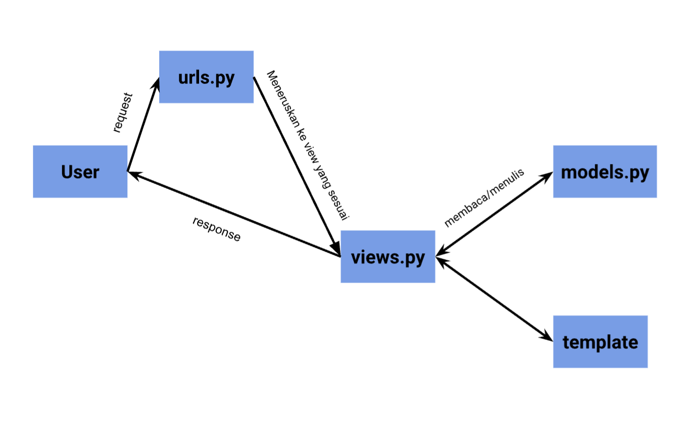
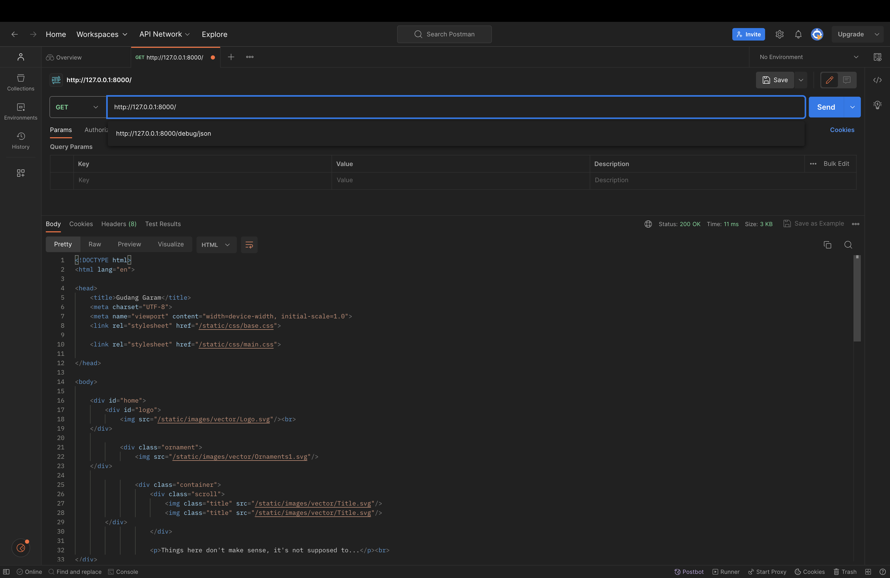
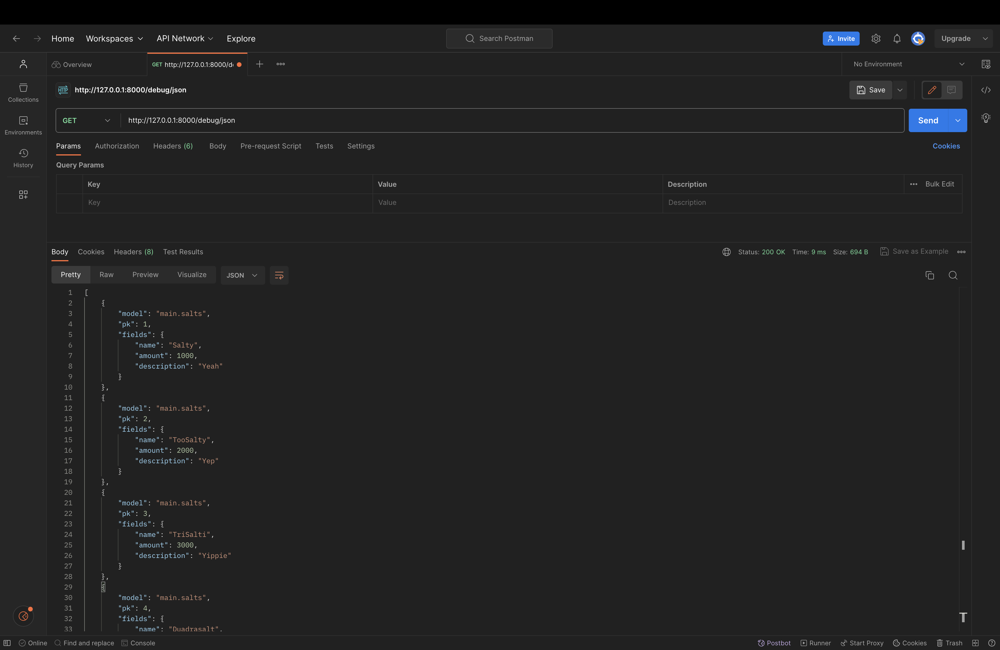
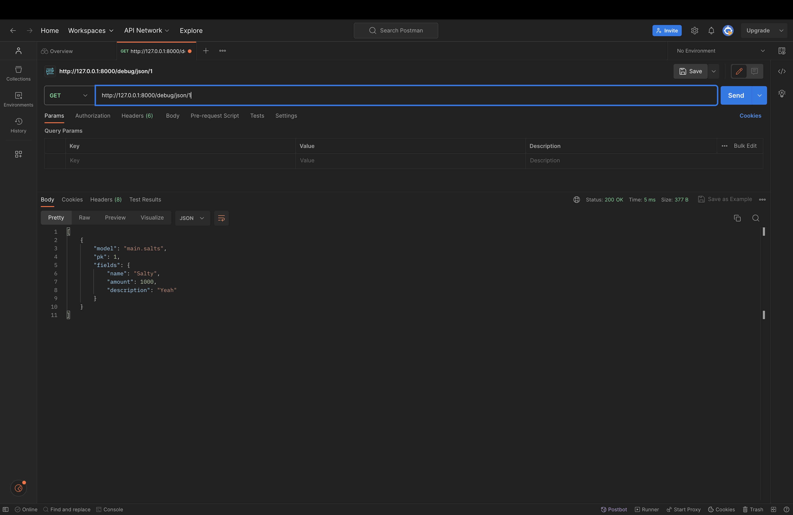
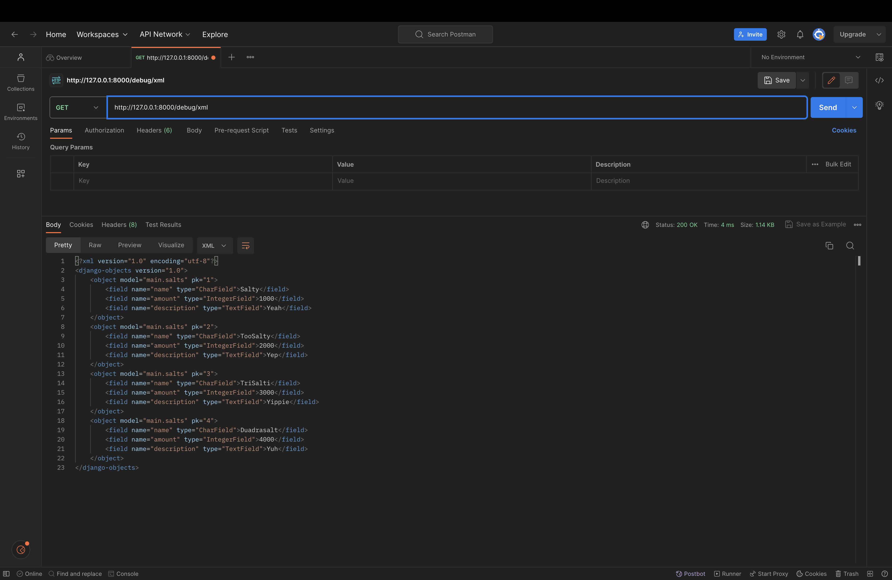
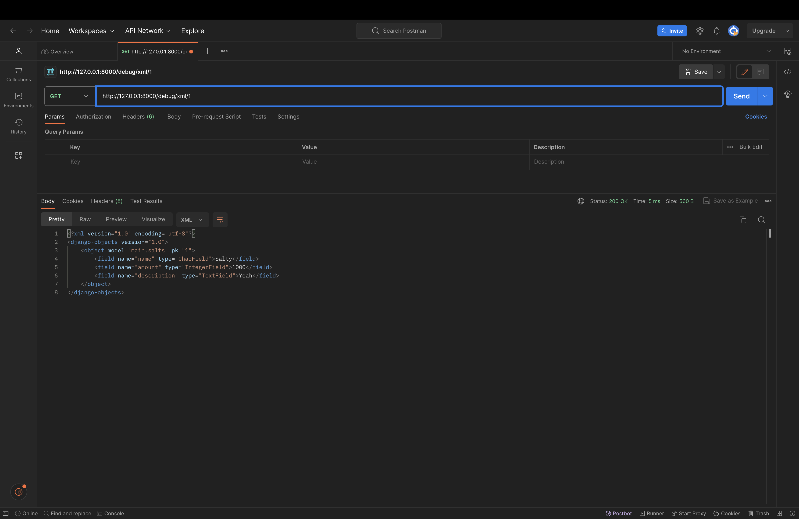

# Gudang Garam

Sebuah proyek Django sederhana sebagai Tugas Mata Kuliah Pemrograman Berbasis Platform oleh Alden Luthfi 2206028932. Proyek ini di buat dengan sistem operasi MacOS.

## Tugas 2

### Proses Pembuatan Projek Django
1. Membuat sebuah _repository_ Github baru bernama ```gudanggaram```
2. Meng-_clone repostiory_ kosong tersebut ke komputer
3. Di direktori asal Membuat _virtual environment_ Python baru dengan command:

    ```bash
    python -m venv env
    ```
4. Menyalakan _virtual environment_ Python baru dengan command:
    ```bash
    source env/bin/activate
    ```
5. Mempersiapkan _requirements_ dengan _neovim_
    ```bash
    nvim requirements.txt
    ```
    isi dari requirements.txt
    ```
    django
    gunicorn
    whitenoise
    psycopg2-binary
    requests
    urllib3
    ```
6. Meng-_install requirements_ dengan pip
    ```bash
    Python -m pip install -r requirements.txt
    ```
7. Membuat proyek Django baru dengan command:
    ```bash
    django-admin startproject gudanggaram .
    ```
8. Mengubah ```ALLOWED_HOSTS``` di file ```settings.py``` dengan menambahkan ```"*"``` agar proyek ini bisa dijalankan di host/domain apapun.

9. Membuat aplikasi ```main``` dengan command:
    ```bash
    python manage.py startapp main
    ```
10. Menambahkan nama aplikasi ke ```INSTALLED_APPS``` pada file ```settings.py``` di direktori ```gudanggaram```

11. Me-_routing_ url pada file ```urls.py``` di direktori ```guadnggaram``` sehingga isi file ```urls.py``` menjadi:
    ```python
    from django.contrib import admin
    from django.urls import path, include

    urlpatterns = [
        path('admin/', admin.site.urls),
        path('', include('main.urls')),
    ]
    ```
12. Mengubah ```models.py``` menjadi:
    ```python
    from django.db import models

    class Product(models.Model):
        name = models.CharField(max_length=255)
        amount = models.IntegerField()
        description = models.TextField()
    ```
13. Melakukan migrasi dengan command:
    ```
    python manage.py makemigrations
    python manage.py migrate
    ```
14. Membuat direktori template dan template ```html``` untuk laman ```main```:

    ```html
    <h1>{{ app_name }} Page</h1>

    <h5>Name: </h5>
    <p>{{ name }}<p>
    <h5>Class: </h5>
    <p>{{ class }}<p>
    ```
15. Menambahkan fungsi untuk me-_render_ laman main pada file ```views.py```:
    ```python
    from django.shortcuts import render

    def show_main(request):
        context = {
            'app name': 'Gudang Garam',
            'name': 'Alden Luthfi',
            'class': 'PBP B'
        }

        return render(request, "main.html", context)
    ```

16. Melakukan routing pada aplikasi ```main``` pada file ```urls.py``` di direktori main:
    ```python
    from django.urls import path
    from main.views import show_main

    app_name = 'main'

    urlpatterns = [
        path('', show_main, name='show_main'),
    ]
    ```

17. Mengetest aplikasi pada localhost dengan command:
    ```
    python manage.py runserver
    ```
    kemudian membuka ```http://localhost:8000/``` di _browser_

18. Melakukan deploy app ke situs _Adaptable_

### Jawaban dari Pertanyaan

1. **Bagan Arsitektur Django**

Terlihat bahwa _request_  dari user akan diproses terlebih dahulu sehingga dapat diteruskan ke View yang sesuai. kemudian View tersebut akan membaca/menulis data di Model dan menggunakan Template untuk menampilkan dan mengembalikan _response_ ke _user_

2. **Mengapa perlu menggunakan virtual environment untuk membuat suatu proyek**

    Sebuah _virtual environment_ memberikan kebebasan seorang _developer_ yang memiliki banyak proyek untuk menggunakan _dependency_ yang mungkin saling bertabrakan jika disatukan tanpa menggunakan _virtual environment_. Secara singkat, sebuah _virtual environment_ menghindari terjadinya konflik pada proyek, baik itu konflik versi, konflik _dependency_, dsb.

3. **Penjelasan Arsitektur MVC, MVT dan MVVM**

    **MVC**

    MVC adalah singkatan dari Model, View, dan Controller. Pada arsitektur proyek ini, tiga komponen aplikasi ini mempunyai tugas yang berbeda-beda. komponen Model bertugas untuk meng-_handle_ logic dan segala fungsionalitas yang dibutuhkan oleh _user_. komponen View
    bertugas untuk mengelola tampilan yang dilihat oleh _user_. komponen Controller
    memroses _request_  dari _user_ dengan berkomunikasi dengan Model untuk mengolah data kemudian
    berkomunikasi dengan View untuk menampilkan laman kepada _user_

    **MVT**

    MVT adalah singkatan dari Model, View, Template. Pola arsitektur ini mirip dengan pola MVC. hanya saja, yang bertugas untuk mengelolas tampilan adalah komponen Template sedangkan komponen View-lah yang bertugas untuk berkomunikasi antara
    Model dan Template.

    **MVVM**

    MVVM adalah singkatan dari Model, View, ViewModel. pada arsitektur ini, komponen ViewModel menjadi penengah antara View dan Model. Interaksi dari _user_ akan diterima oleh View dan diteruskan ke ViewModel yang akan memperbaharui Model dan meneruskan perubahan yang ada kepada masing masing View dan Model.

    **Perbedaan Antara Ketiganya**

    Perbedaan antara MVVM dan MVC/MVT mungkin jelas terlihat. Sehingga ada baiknya kita membedakan antara MVT dan MVC. Pada MVC, komponen Controllerlah yang menerima _request_  dan memberikan respons kepada _user_, Controler memanipulasi Model untuk mengambil Data kemudian meneruskannya ke View agar View bisa memproses Data dari Model dan menampilkan tampilan yang sesuai, kemudian Controller akan mengembalikan respons kepada _user_. Sedangkan pada MVT, _request_  dari _user_ akan diteruskan ke View yang bersangkutan, kemudian View akan membaca/menulis data kepada Model dan menggunakan Template untuk mengembalikan _response_ kepada _user_. Perbedaan utama pada kedua ini adalah pada MVT, seorang _developer_ tidak lagi berperan sebagai penulis logika dari Controller pada aplikasinya.

    Untuk MVVM, berbeda dari yang lain, komponen View dan komponen Model pada arsitektur ini tidak berkomunikasi sama sekali.

## Tugas 3

### Proses Implementasi Form

1. Membuat ```forms.py``` di direktori ```main``` dengan isi

    ```python
    from main.models import Salts
    from django import forms

    class SaltsForm(forms.ModelForm):
        class Meta:
            model = Salts
            fields = '__all__'

    ```

2. Menambahkan Method ```create_page``` untuk menambah entri database di file ```views.py``` di direktori ```main```

    ```python
    def create_page(request):
        form = SaltsForm(request.POST or None)

        if request.method == "POST" and form.is_valid():
            form.save()
            return HttpResponseRedirect(reverse('main:main_page'))

        context = {'form': form}

        return render(request, "create.html", context)

    ```

    BONUS: Saya juga menambahkan fungsionalitas delete untuk menghapus entri pada database

3. Routing URL ke laman yang bersangkutan di file ```urls.py``` di direktori ```main```

    ```python
    urlpatterns = [
        ...
        path('create/', create_page, name='create'),
        path('delete/<int:id>/', delete_salt, name='delete'),
        ...
    ]

    ```

4. Menambahkan folder ```templates``` di direktori utama dan ```base.html``` sebagai basis dari laman-laman lain

5. Menambahkan lokasi folder ```templates``` tersebut ke ```settings.py``` di direktori ```gudanggaram```

    ```python
    ...
    'DIRS': [BASE_DIR / 'templates'],
    ...
    ```

6. Mengimplementasikan database ke dalam laman utama ```main.html``` dan juga menjadi perpanjangan dari ```base.html``` di direktori utma

    ```html
    ...
    <table>
        <tr>
            <th>Name</th>
            <th>Amount</th>
            <th>Description</th>
            <th></th>
        </tr>

        
            <tr>
                <td>{{salt.name}}</td>
                <td>{{salt.amount}}</td>
                <td>{{salt.description}}</td>
                <td id="delete">
                    <a href="">
                        <button class="tablebutton">
                            Delete
                        </button>
                    </a>
                </td>
            </tr>
        
    </table>
    ...
    ```
7. Menggunakan folder ```static``` untuk mengorganisir aset-aset yang digunakan seperti gambar dan *stylesheet* CSS untuk mempercantik laman

8. Membuat app baru bernama ```debug``` untuk melihat tampilan JSON dan XML dari app ```main```

9. Menambahkan fungsi-fungsi yang diperlukan untuk menampilkan JSON dan XML baik secara keseluruhan maupun per entri database

    ```python
    def show_xml(request):
        data = Salts.objects.all()
        return HttpResponse(serializers.serialize("xml", data), content_type="application/xml")

    def show_json(request):
        data = Salts.objects.all()
        return HttpResponse(serializers.serialize("json", data), content_type="application/json")

    def show_xml_by_id(request, id):
        data = Salts.objects.filter(pk=id)
        return HttpResponse(serializers.serialize("xml", data), content_type="application/xml")

    def show_json_by_id(request, id):
        data = Salts.objects.filter(pk=id)
        return HttpResponse(serializers.serialize("json", data), content_type="application/json")

    ```

10. Merouting kembali URL yang bersangkutan di file ```urls.py``` di direktori ```debug```

    ```python
    urlpatterns = [
        path('json/', show_json, name='json'),
        path('xml/', show_xml, name='xml'),
        path('json/<int:id>/', show_json_by_id, name='json_by_id'),
        path('xml/<int:id>/', show_xml_by_id, name='xml_by_id'),
    ]
    ```

11. Mengetest aplikasi pada localhost dengan command:
    ```
    python manage.py runserver
    ```
    kemudian membuka ```http://localhost:8000/``` di _browser_

12. BONUS: terkena ban di *platform* Adaptable

### Jawaban Dari Pertanyaan

1. **Perbedaan antara POST dan GET**

    Perbedaan antara keduanya terletak pada tujuan masing masing metode digunakan. Metode GET biasa digunakan ketika *user* ingin mendapatkan data dari server. Sedangkan, metode POST digunakan ketika *user* ingin mengirim data ke server. Penggunaan metode GET
    untuk mengirimkan data mengharuskan *user* untuk menuliskan data yang mau disampaikan ke server di dalam url, sehingga data-data pribadi sangat tidak aman jika dikirimkan dengan data ini ketimbang metode POST.

2. **Perbedaan antara HTML vs JSON vs XML**

    Pada kasus ini HTML berada pada cakupan yang berbeda dengan JSON dan XML. HTML digunakan sebagai kerangka dasar sebuah website, HTML menentukan apa saja yang akan tampil di website tersebut dan penggayaan yang sederhana. sedangkan JSON dan XML adalah sarana transfer data, XML cenderung lebih sulit dibaca daripada JSON namun dianggap sebagai struktur data yang lebih *robust* dari JSON. Meskipun demikian, JSON memiliki *support* terhadap *array* sedangkan XML tidak. Diantara perbedaan yang sudah disebutkan masih banyak perbedaan lain, pada hakikatnya JSON dan XML berperan sama yaitu mentransfer data namun format penulisan dan kemampuannya lah yang membedakannya.

3. **Mengapa JSON lebih banyak dipakai di web modern**

    JSON lebih banyak dipakai karena formatnya yang lebih mudah dibaca manusia. Selain itu, format JSON yang cenderung memiliki karakter lebih sedikit dari format lain seperti XML memungkinkan JSON untuk diproses lebih cepat daripada format lain.

### Screenshot Postman

1. **HTML Source**


2. **JSON**


3. **JSON by ID**


4. **XML**


5. **XML by ID**

